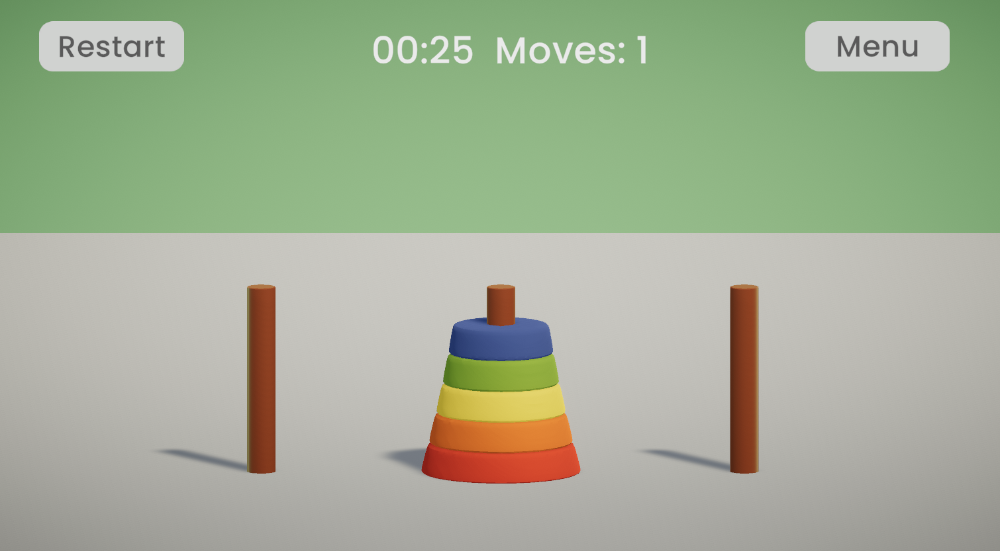

# Tower of Hanoi

# Approach

* 3D Game: The Towers of Hanoi game is built in 3D to make the gameplay more immersive.
* Making the camera orthographic.
* Mouse Controls: Players interact with the game using the mouse, providing intuitive click-and-drop mechanics to move the disks. The gameplay is divided in 3 phases, the user has to select a disk, the disk is then lifted from the rod, when the user hovers over the other rods he can move the disk on top of them a click on the desired rod will place the disk on it.
* Structure: The game contains two scenes: 
    * [*Menu.unity*](Assets/Scenes/Menu.unity) A title screen menu to start the game.
    * [*Main.unity*](Assets/Scenes/Main.unity) The main class that contains the game itself.
* The game is working with three different scripts:
    * [*GameController.cs*](Assets/Scripts/GameController.cs) The main script determines the state of the game, whether a disk is clicked, moved, picked or placed and whether the game has been won.
    * [*Disk.cs*](Assets/Scripts/Disk.cs) Is placed on every disk and specifies the size of the disk, the mouse events on disks and contains properties of a disk.
    * [*Rod.cs*](Assets/Scripts/Rod.cs) Is placed on every rod and specifies the number of slots on each rod, the mouse events on rods and contains properties of a rod as well as the disks contained on a rod.
* Setup: The game consists of 3 rods and 5 disks, following the standard Towers of Hanoi setup and the requirement
* Assets: Tower and disks downloaded here: https://sketchfab.com/3d-models/toy-pyramid-ab879792a7454cf4ba33bdb5d0b03e19
Opened in Blender and exported as .fbx
* Music: Sound effects downloaded from https://pixabay.com/sound-effects/ 

# Challenges

* Ensuring that the disk movement and constraints (e.g., a larger disk can't be placed on a smaller disk) work smoothly.
* Implementing mouse click detection and drag-and-drop behavior and logic.
* Animating the disks when moving them between rods, so it goes up and then follows a linear trajectory to another rod before being placed.
* Animations were an issue because they override transform movements on objects, I tried to implement animations on disks but it was taking too much time so I decided to remove these extra animations.

# Additional Features
* Reset Button: Allows the player to reset the game to its initial state.
* Menu Button: A basic menu button to go back to the title screen.
* Animations: Disk trajectories are animated the disk goes up and then sideways before going down on a rod.
* Sound Effects: Sound effects provide feedback during gameplay, such as when disks are moved or when an invalid move is attempted.
* Highlighting: The selected disk or rod are highlighted to make the game state clearer to the player. The material of the object changes depending on the state of the game.
* Impossible move: If the user attempts to make an impossible move the rod becomes red and a sound is emitted.
* Move Counter: Keeps track of how many moves the player has made.
* Timer: Tracks the time taken to solve the puzzle.
* Title Screen: A welcome screen that lets the player begin or reset the game.
* Instructions: Explain the rules to new players at the beginning of the game, the message disappears when the user clicks on a disk.

# Potential Improvements
* Background Music and Sound Toggle: Adding an option to turn the music and sound effects on/off.
* Pause Button: Implement a pause functionality for players to take a break mid-game.
* Highscore List: A leaderboard that ranks players based on the number of moves and time taken.
* Exit Button: A button to close the game.
* Animations: The disk could shake when an impossible move is attempted by the user. Other additional animations could be added, like a spinning movement when the disk goes down a rod.

# Evaluation questions
1. Did you use any AI?

    Yes, I used GitHub Copilot to assist with some coding suggestions. I also used ChatGPT to generate basic functions that I needed, it is a quicker way to get a function than a google search, especially for simple functions like time displaying.
    Additionally, I consulted forums and YouTube tutorials to solve specific challenges and learn best practices, but the implementation and logic were developed by me.

2. What considerations would you make if this game was displayed in a public setting?

    If the game were displayed in a public setting, I would focus on:
    1. Accessibility and Inclusivity - Ensure the game is accessible to people with diverse abilities. For example, have features like adjustable text sizes, color contrast options, and an easy-to-navigate interface to support individuals with visual impairments. If possible I would include alternative input methods for people with motor challenges, such as keyboard shortcuts or assistive devices like joysticks. Have diverse forms of feedback - auditory, visual haptic feedback. This ensures that players with hearing, vision, or cognitive impairments can still engage fully.
    Also, I would like to include the language selection and/or icon-based instructions depending on the context.
    2. Engagement - Games in public spaces should capture attention quickly. I would incorporate animated start screens that introduce the game with simple instructions, or demo sequences to draw people in. Since public settings attract casual or inexperienced players, the game must be easy to understand and play. It would need a tutorial or hints for new users.
    3. Social Play Features: While the focus of Towers of Hanoi is on single-player, I would encourage social interaction by displaying a leaderboard or tracking high scores. This adds a layer of community competition, especially for settings where multiple people may take turns playing.
    4. Tailor the sound design and on-screen elements to suit the location's noise levels and lighting. Public environments vary, so the game should perform equally well in both bright spaces and dim environments. Clear, high-contrast graphics for visibility in varied lighting conditions, with scalable UI for different screen sizes.
    5. Simplifying Interactions- Make it easy to reset or start a new game after each round. This could include clear on-screen prompts or buttons to restart.
    6. Replayability: Offering different difficulty levels, like choosing the number of disks could engage players for longer periods.

3. What considerations would you make if this game was implemented on a multitouch screen?

    For multitouch, I would consider the following:
    1. Touch Controls: Replace mouse controls with touch gestures. large multi touch screens encourage users to interact using multiple fingers or full-hand gestures. However, dragging disks over long distances could become physically tiring. To avoid this, I would minimize the need for repeated or complex drag-and-drop motions. Instead I would have shorter swipes or tap-and-select gestures​. I would also ensure that the game responds quickly to touch inputs.
    2. Screen Size and Reachability: On larger multitouch screens, critical interactive elements (like the pegs and disks in the game) should be placed within easy reach, ideally within a height range of 36-60 inches from the ground. Avoid positioning essential features near the edges or too high, as this might make them hard to reach for some users, especially children or individuals with mobility limitations.​
    3. Scaling Elements: Ensure that all visual elements, such as the disks, are appropriately sized for the size of the display. This includes the size of fonts, buttons, and interactive zones to make them easily visible and clickable. 
    4. Feedback and Visibility: Provide immediate feedback when a disk is moved, like highlighting disks and rods when hovered, shaking or change of color when it is not possible to make the move, sound and visual effects for the correct or wrong move.
